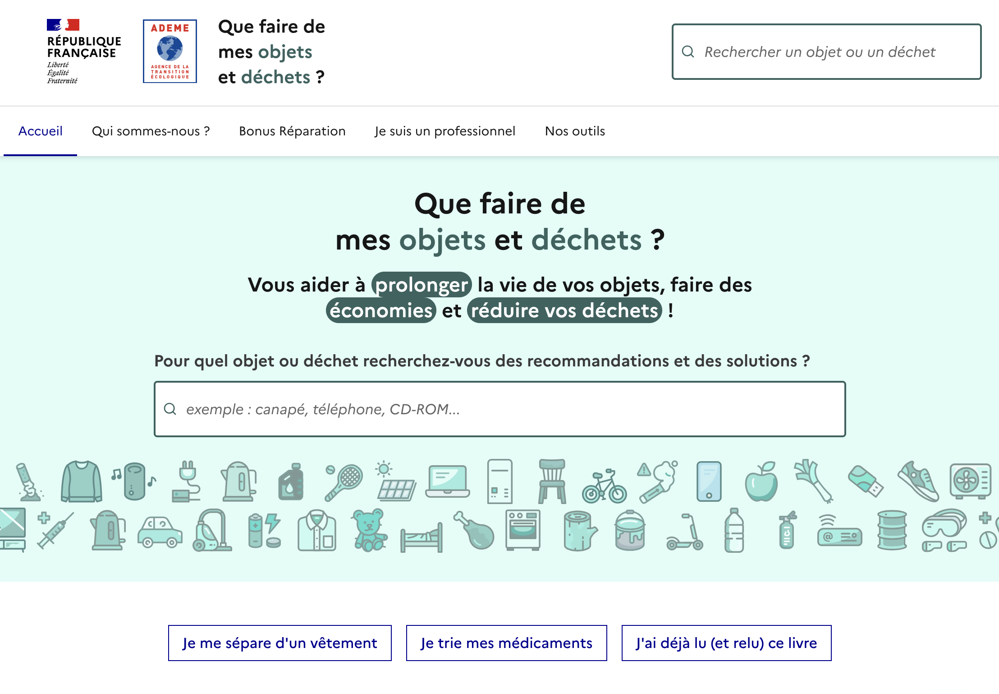
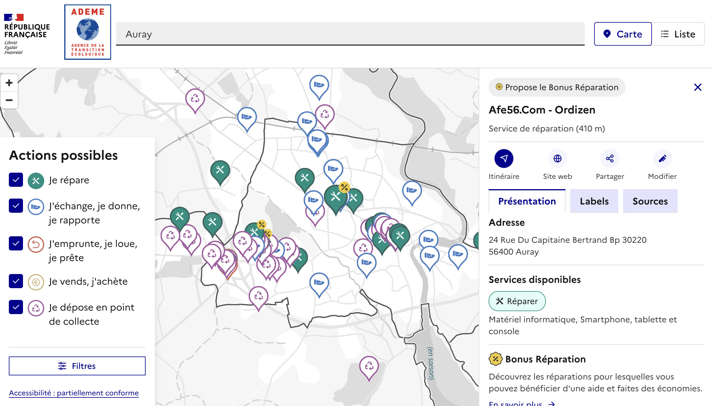
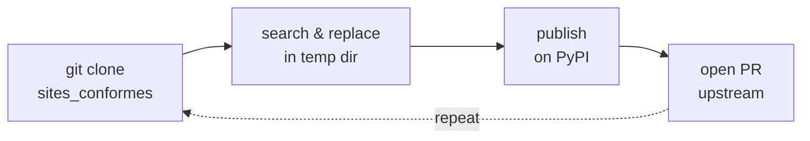
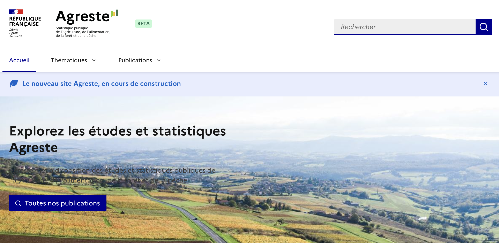
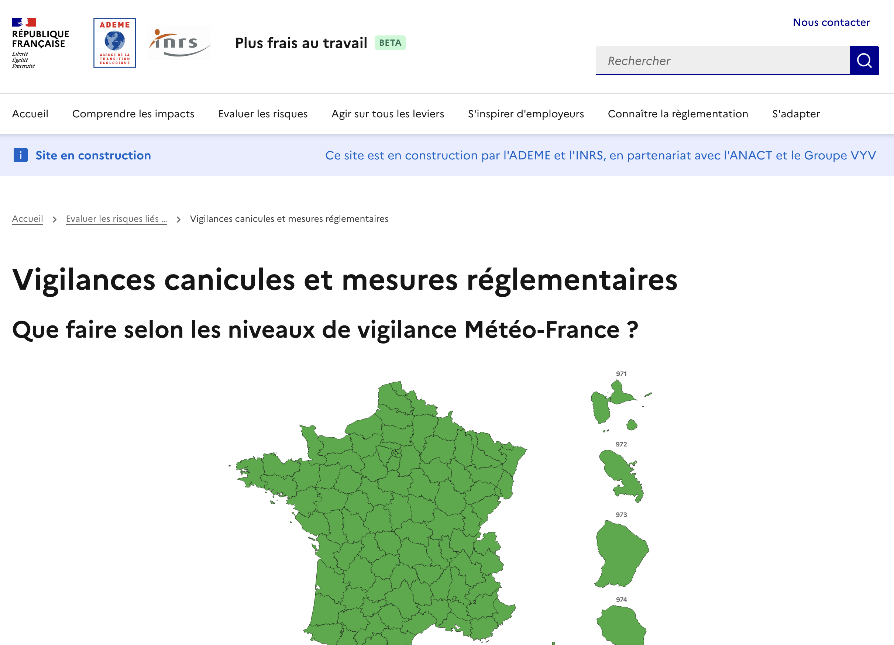
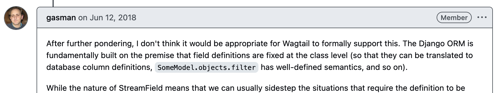

<!-- font_size: 3 -->

<!-- 
speaker_note: |
Discovered Wagtail in 2016, initially as backend for next.js, quickly used it headless
Then went back from this approach and using it as a monolith since 2018
Worked with torchbox for a few months
Working for french government agencies since 2022
-->
# Hi

<!-- column_layout: [1, 1] -->
<!-- column: 0 -->
Freelance software engineer  

Working with Wagtail since 2016    
- Public sector
- NGOs
- web agencies

<!-- column: 1 -->


<!-- end_slide -->


<!-- font_size: 2 -->
<!-- 
speaker_note: |
Frontend coupled to a data-platform that helps citizens with RRR : reuse, recycle, repair (or trash)
We aggregate all french locations related to this topic, categorized by objects and type of service provided by these actors.
It is developped since 2022, based on django. 
Coupled to basic content pages, with fixed list of charfields in django.

Over the time, users wanted to add an image field.
That should be orderable. 
In the mean time, DINUM developped Sites Conformes.
In the mean time, our content editor shipped a Sites Conformes, as a landing page for the project. 

I suggested "let's add Wagtail, on top of django. Content editors will be at ease"
So we added a streamfield, with a single imagefield

Then, my content editors asked me "could we do things in the Que Faire that we do in Sites Conformes".
That got me thinking. 
Let's add Sites Conformes to our django project
-->

# What

## Que Faire de Mes Objets et Déchets
ADEME - The French Agency for Ecological Transition

<!-- column_layout: [1,1] -->
<!-- column: 0 -->

<!-- column: 1 -->


<!-- pause -->

<!-- reset_layout -->
## Timeline 
- 2021 : original static **gatsby** website
<!-- pause -->
- 2022 : the **django-based data-platform**
<!-- pause -->
- 2024 : **migrate** the legacy website into the django app
<!-- pause -->
- 2025 : adopt **Sites Conformes for a landing page**
<!-- pause -->
- 2026 : adopt **Sites Conformes & Wagtail** as our main content management system
<!-- pause -->


<!-- end_slide -->


<!-- font_size: 3 -->
# How 

  
<!-- pause -->
Fork
<!-- pause -->
Publish Sites Conformes as a python package
<!-- pause -->
~~Enjoy~~
<!-- pause -->
<!-- 
speaker_note: |
Then I realised that django app names was going to be an issue : 
-->

<!-- font_size: 2 -->
<!-- column_layout: [1,1] -->
<!-- column: 0 -->

```shell
sites_conformes
| .git
| blog
| content_manager
| events
| forms # oh no
```


<!-- column: 1 -->

```shell
sites_conformes
| .git
| templates
| | base.html # no again
```

<!-- 
speaker_note: |
Two kinds of collisions.
App names: "forms", "blog", "events" are the most generic names possible,
they will clash with the host project sooner or later.
Templates: "base.html" at the root of the template loader
shadows (or gets shadowed by) the host project's own base.html —
django template loading is a flat namespace, first match wins.
-->

<!-- end_slide -->
<!-- font_size: 3 -->

# How
## Namespace !

<!-- font_size: 2 -->
<!-- column_layout: [1,2] -->
<!-- column: 0 -->

```shell
sites_conformes
| .git
| sites_conformes
| | blog
| | content_manager
| | events
| | forms
| | templates
| | | sites_conformes_core/base.html
```

<!-- column: 1 -->
```python
# sites_conformes/blog/apps.py
from django.apps import AppConfig

# Before
class BlogConfig(AppConfig):
    default_auto_field = "django.db.models.BigAutoField"
    name = "blog"
    label = "blog"

# After
class BlogConfig(AppConfig):
    default_auto_field = "django.db.models.BigAutoField"
    name = "sites_conformes.blog"
    label = "sites_conformes_blog"
```

<!-- reset_layout -->
Things started to work...
<!-- pause -->
...until the next Sites Conformes version, that added a new django app.

<!-- 
speaker_note: |
The fix is the standard python packaging move: nest everything under one package.
Two changes per app: the dotted "name" is the import path,
the prefixed "label" is what django uses everywhere else —
table names, content types, migration dependencies.
That label change is why so much breaks downstream.
Templates get their own namespace directory too.
I did all of this by hand the first time. It worked.
Then upstream released a new version with a brand new app...
and I was looking at redoing the whole refactor manually. 
-->

<!-- end_slide -->


<!-- 
speaker_note: |
So the manual refactor became a script: paquet-facile.
One command, takes the upstream tag, nothing else.
All the knowledge lives in a single YAML file:
the package name, the list of django apps, and the transformation rules.
Rules are templates: {app} is expanded for every app in the list.
First rule: rewrite AppConfig, inject the namespaced name and label.
Second rule: fix ForeignKey targets in migrations.
When upstream adds a new app, the fix is one line in the apps list.
-->

<!-- font_size: 2 -->

# How
## Let's script 

**https://github.com/fabienheureux/paquet-facile**
<!-- column_layout: [1, 1] -->
<!-- column: 0 -->

```shell
# Synchroniser avec la version v2.1.0
./paquet_facile.py v2.1.0
```

<!-- pause -->
<!-- reset_layout -->

<!-- font_size: 1 -->
<!-- column_layout: [1, 1] -->
<!-- column: 0 -->

```yaml
# Package name for namespacing (used in {package_name} placeholder)
package_name: sites_conformes

# Django apps shipped inside the namespaced package.
# NOTE: `config` is intentionally absent — it's the Django project (settings,
# urls, wsgi), not an app, and lives at release-branch root next to manage.py.
apps:
  - blog
  - events
  - forms
  - content_manager
  - proconnect
  - dashboard
  - menus
  - db_storage
  
```

<!-- pause -->

<!-- column: 1 -->
```yaml
rules:
  # ---------- Apps configuration ----------
  # Transform app name in AppConfig classes
  - search: '(    name = ")({app})(")'
    replace: '\1{package_name}.\2\3\n    label = "{package_name}_\2"'
    path_glob: "**/apps.py"

  # ---------- Generic patterns (expanded per app) ----------
  - search: 'to="{app}\.'
    replace: 'to="{package_name}_{app}.'
    scope: migrations

```


<!-- end_slide -->


<!-- font_size: 2 -->
# How
## Not just imports

<!-- font_size: 1 -->
<!-- column_layout: [1, 1] -->
<!-- column: 0 -->

```yaml
# settings.py: INSTALLED_APPS entries
- search: '"{app}"'
  replace: '"{package_name}.{app}"'
  scope: settings
  literal: true

# template inheritance
- search: ''
  replace: ''
  scope: all
  literal: true
```

<!-- pause -->
<!-- column: 1 -->

```yaml
# raw SQL in migrations — DB tables
# are prefixed with the app label
- search: '(\b(?:UPDATE|FROM|JOIN|INTO|TABLE)\s+){app}_'
  replace: '\1{package_name}_{app}_'
  scope: migrations

# Wagtail admin URL names are
# derived from the app label too
- search: "wagtailsnippets_{app}_"
  replace: "wagtailsnippets_{package_name}_{app}_"
  scope: all
```

<!-- reset_layout -->
<!-- font_size: 2 -->
<!-- pause -->

imports, migrations, templates, raw SQL, reverse() names... ~80 rules total

<!-- 
speaker_note: |
The generic import rules get you 80% of the way.
The long tail is everything Django derives from the app label:
database table names in raw SQL, wagtail admin URL names,
template paths, reverse accessors.
Each new upstream release surfaced a few more — they all became rules.
-->

<!-- pause -->


<!-- font_size: 2 -->
## and repeat



<!-- 
speaker_note: |
One command, fully repeatable: clone upstream at the tag,
run all the search & replace rules in a temp dir,
rename content_manager to core, build the nested package structure,
generate pyproject.toml and README from templates,
clean up, push a release branch, publish on PyPI.
Same tag as upstream — versioning stays iso.
-->

<!-- end_slide -->


<!-- font_size: 2 -->
# How 

## Installation

https://docs.wagtail.org/en/stable/advanced_topics/add_to_django_project.html

<!-- pause -->

<!-- font_size: 1 -->
<!-- column_layout: [1] -->
<!-- column: 0 -->

```shell
uv add sites-conformes    
```
```python

import sites_conformes

INSTALLED_APPS.extend([
    "dsfr",
    # Le package lui-même (fournit les templates de base partagés)
    "sites_conformes",
    # Les apps qu'il contient
    "sites_conformes.core",
    "sites_conformes.blog",
    "sites_conformes.events",
    "sites_conformes.forms",
    "sites_conformes.menus",
    "sites_conformes.dashboard",
])

TEMPLATES[0]["OPTIONS"]["context_processors"].extend([
    "wagtailmenus.context_processors.wagtailmenus",
    "sites_conformes.core.context_processors.skiplinks",
    "sites_conformes.core.context_processors.mega_menus",
])


PACKAGE_DIR = Path(sites_conformes.__file__).resolve().parent

TEMPLATES[0]["DIRS"].append(PACKAGE_DIR / "templates")
STATICFILES_DIRS = (PACKAGE_DIR / "static",) + tuple(STATICFILES_DIRS)
```
<!-- pause -->

<!-- font_size: 2 -->
## The merge & deployment

rename tables 
<!-- pause -->
update migrations table
<!-- pause -->
update content_types table
<!-- pause -->


```shell
python manage.py migrate_from_sites_faciles
```

<!-- 
speaker_note: |
In a fresh project, installation is one line. Done.
The hard part was our own case: production already had
Sites Conformes tables created when the code lived inside the repo.
Renaming the app label means django no longer recognizes anything:
tables must be renamed, the django_migrations table rewritten,
and content_types updated so pages keep pointing at the right models.
All of it wrapped in a single management command — one deploy, no data loss.
-->


<!-- end_slide -->


<!-- 
speaker_note: |
It works — in production, on real sites.
The editable install is the underrated win: you hack on the package
from a consuming project and see changes live, great dev loop.
Repeatable: new upstream tag, run the script, new package version on PyPI.
And documentation: every rule in the YAML has a comment saying WHY it exists.
Six months later, that's the only reason I can still maintain it.
-->
<!-- font_size: 2 -->
# Lessons learned

<!-- pause -->

it works
<!-- pause -->

starting with standalone wagtail does not prevent you from making it reusable later 
<!-- pause -->

`uv add --editable ../sites_conformes` from another project
<!-- pause -->

repeatable
<!-- pause -->

write documentation early


<!-- pause -->
`--dry-run` and logs


<!-- end_slide -->


<!-- font_size: 2 -->
# demo 
<!-- font_size: 1 -->

<!-- column_layout: [1, 1] -->
<!-- column: 0 -->
```python

# blocks.py
from sites_conformes.content_manager.blocks import (
    STREAMFIELD_COMMON_BLOCKS as sites_conformes_BLOCKS,
)
from wagtail import blocks

STREAMFIELD_COMMON_BLOCKS = [
  *sites_conformes_BLOCKS,
  (
      "carte_sur_mesure",
      blocks.SnippetChooserBlock(
          "qfdmo.CarteConfig",
          label="Carte sur mesure",
          template="ui/blocks/carte.html",
      ),
  ),
]


# models.py

from my_app.blocks import STREAMFIELD_COMMON_BLOCKS

class ProduitPage(Page)
    body = StreamField(
        STREAMFIELD_COMMON_BLOCKS,
        verbose_name="Corps de texte",
        blank=True,
    )

```

<!-- column: 1 -->
```html





<div
    class="qf-flex qf-flex-col
    qf-gap-5w
    max-lg:qf-pr-0"
>
    <div class="qf-flex qf-flex-col max-md:qf-order-2 md:qf-row-start-2 md:qf-col-span-2">
        
        
    </div>
</div>


```
<!-- reset_layout -->
<!-- pause -->

<!-- font_size: 3 -->
https://quefairedemesdechets.ademe.fr/cms

<!-- end_slide -->


<!-- font_size: 2 -->

<!-- 
speaker_note: |
Not just us anymore.
Agreste — agricultural statistics — added advanced search and categories
on top of the package.
Plus Frais Au Travail built custom blocks, a map, advanced forms.
The point: they extend Sites Conformes without forking it.
They get upstream updates by bumping a version number.
-->
# Adoption

https://quefairedemesdechets.ademe.fr

<!-- pause -->

<!-- column_layout: [1, 1] -->
<!-- column: 0 -->
Agreste, advanced search and categories  
https://agreste.beta.gouv.fr/
<!-- column: 1 -->

<!-- reset_layout -->

<!-- pause -->
<!-- column_layout: [1, 1] -->
<!-- column: 0 -->
Plus Frais Au Travail, custom blocks with map and advanced forms  
https://plusfraisautravail.beta.gouv.fr/
<!-- column: 1 -->



<!-- end_slide -->


<!-- font_size: 2 -->


<!-- 
speaker_note: |
Where this goes next.
Optional features: consumers shouldn't have to install every app and model.
Swappable models: on the wagtail roadmap, would replace
most of my special-case rules with a supported mechanism.
An extensible streamfield: let consumers register their own blocks —
but StreamField definitions generate migrations in the CONSUMER's project,
that's the big blocker. Known issue since 2017, see Matt's comment.
Several projects worked around it: links on the slide.
Finally: decouple from the french design system,
so the same packaging approach works for any Wagtail distribution.
-->
# What's next

<!-- pause -->
optional features
<!-- pause -->

swappable models - https://github.com/wagtail/roadmap/issues/126
<!-- pause -->

an extensible streamfield
<!-- pause -->
stop StreamField from generating migrations :
- https://dev.to/joeyjurjens/dynamic-blocks-for-wagtail-streamfields-bf1
- https://gist.github.com/zerolab/cbd19becd21a5ab12a711674d5979157
- https://cynthiakiser.com/blog/2022/01/06/trimming-wagtail-migration-cruft.html
- https://github.com/mozmeao/springfield/blob/main/springfield/cms/fields.py
<!-- pause -->
- https://github.com/wagtail/wagtail/issues/3735#issuecomment-396704626




<!-- pause -->

use with other design systems outside of french government ?
<!-- pause -->

<!-- end_slide -->


<!-- font_size: 4 -->
# thanks !
